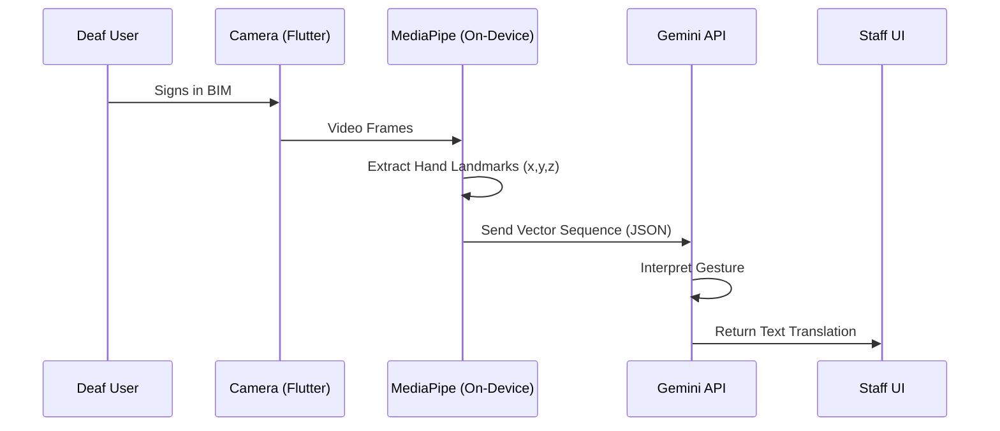

# SignSpeak Live: Technical Documentation

## 1. System Architecture

SignSpeak Live is built on a hybrid processing model to ensure low latency and high accuracy, crucial for real-time translation.

### 1.1 High-Level Data Flow



### 1.2 Core Components

1.  **Flutter Frontend**: The presentation layer handling camera input, UI rendering, and state management.
2.  **MediaPipe Service (Local)**: Runs on the device's CPU/GPU. It takes raw video frames and outputs a 21-point skeletal model for each hand.
3.  **Gemini Service (Remote)**: Acts as the translation engine. It receives the lightweight vector data and uses its multimodal/reasoning capabilities to infer the meaning of the gesture.
4.  **Speech Service (Hybrid)**: Uses on-device speech recognition (Android/iOS native) or Google Cloud STT for high-fidelity audio-to-text conversion.

---

## 2. API Reference & Integration

### 2.1 Gemini 3 Flash (Vision/Text)

We use **Gemini 3 Flash** because it offers the best balance of speed and reasoning for this specific use case.

**Endpoint:** `https://generativelanguage.googleapis.com/v1beta/models/gemini-1.5-flash:generateContent`

**System Prompt Strategy:**
The prompt is engineered to act as a linguistic bridge between "Motion Data" and "Natural Language".

> **System Instruction:**
> "You are an expert Sign Language Interpreter for Bahasa Isyarat Malaysia (BIM).
> Input: A JSON array of hand landmark coordinates captured over 1-2 seconds.
> Output: The direct translation of the gesture in English. If the gesture is ambiguous, output '...'."

**Request Payload Structure (Simplified):**
```json
{
  "contents": [{
    "parts": [{
      "text": "[{\"frame\": 1, \"left_hand\": [...], \"right_hand\": [...]}, ...]"
    }]
  }]
}
```

### 2.2 Google Cloud Speech-to-Text

Used for the "Hearing Staff" to "Deaf User" communication loop.

**Configuration:**
*   **Encoding:** `LINEAR16`
*   **Sample Rate:** 16000 Hz
*   **Language Code:** `ms-MY` (Bahasa Melayu) / `en-MY` (Malaysian English)
*   **Model:** `command_and_search` (Optimized for short, directive phrases common in service counters).

---

## 3. Data Models (Firestore)

We utilize Firebase Firestore for session logging and analytics. No personal video or audio data is stored.

### 3.1 Collection: `sessions`

Stores metadata about each translation session.

| Field | Type | Description |
| :--- | :--- | :--- |
| `id` | `string` | UUID for the session. |
| `start_timestamp` | `timestamp` | Server time when session began. |
| `end_timestamp` | `timestamp` | Server time when session ended. |
| `location_id` | `string` | Identifier for the deployment site (e.g., "HKL_Counter_4"). |
| `total_interactions` | `number` | Count of translation exchanges. |

### 3.2 Collection: `logs` (Sub-collection of `sessions`)

Stores individual message events.

| Field | Type | Description |
| :--- | :--- | :--- |
| `sender` | `string` | `user` (Deaf) or `staff` (Hearing). |
| `type` | `string` | `sign_to_text` or `speech_to_text`. |
| `content` | `string` | The translated text. |
| `confidence` | `float` | AI confidence score (0.0 - 1.0). |
| `latency_ms` | `integer` | Processing time in milliseconds. |

---

## 4. Key Classes & Services

### 4.1 `CameraService` (`lib/services/camera_service.dart`)
*   **Responsibility:** Manages the camera controller and the image stream.
*   **Key Method:** `startImageStream(onImage: (CameraImage) -> void)`
*   **Note:** Handles frame rate throttling to prevent overheating and reduce API costs.

### 4.2 `LandmarkParser` (`lib/utils/landmark_parser.dart`)
*   **Responsibility:** Normalizes MediaPipe output.
*   **Logic:** Converts relative coordinates (0.0 - 1.0) to a standardized vector format. It also filters out "noise" (jittery hands) before sending data to Gemini.

### 4.3 `GeminiService` (`lib/services/gemini_service.dart`)
*   **Responsibility:** HTTP wrapper for the Gemini API.
*   **Key Feature:** Implements a "debounce" mechanism. It waits for the user's hands to stop moving (pause in signing) before triggering a request, mimicking how human interpreters wait for a sentence to finish.

---

## 5. Security & Privacy

### 5.1 Data Minimization
*   **Video:** Never leaves the device. Processed in RAM only.
*   **Audio:** Transcribed immediately and discarded.
*   **Logs:** Only text logs are kept for quality assurance.

### 5.2 API Security
*   API Keys are stored in `.env` and injected at build time.
*   In production, these keys should be restricted by application ID (SHA-1 fingerprint) in the Google Cloud Console.

---

## 6. Future Roadmap (Post-MVP)

1.  **Offline Model Distillation:** Fine-tune a TensorFlow Lite model on the Gemini outputs to allow for basic offline translation.
2.  **Custom BIM Vocabulary:** Allow agencies to add custom signs (e.g., "Passport", "Fine", "Report") via a web portal.
3.  **Two-Way Avatar:** Use a 3D avatar to sign back to the user (Text-to-Sign) for a complete loop.
