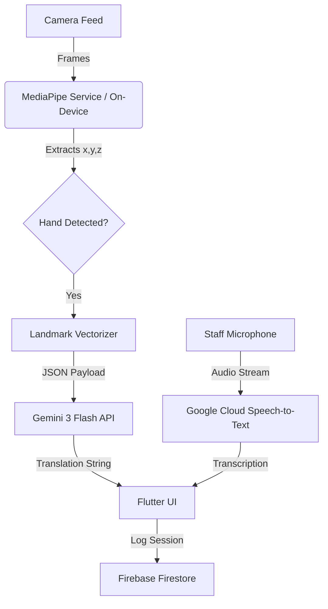

# SignSpeak Live 🤟

> **Bridging the communication gap between the Deaf community and public services using Real-Time AI.**


## 📖 Overview

**SignSpeak Live** is a dual-interface tablet application designed for high-stress environments like hospitals and police stations. It enables seamless two-way communication between Deaf individuals and hearing staff members who do not understand **Bahasa Isyarat Malaysia (BIM)**.

By leveraging **Google's MediaPipe** for on-device hand tracking and **Gemini 3 Flash** for interpretation, we provide a low-latency, bandwidth-efficient solution that works even in rural areas with poor internet connectivity.

### 🎯 SDG Alignment
- **Goal 10:** Reduced Inequalities (Empowering the deaf community).
- **Goal 3:** Good Health and Well-being (Improving communication in hospital settings).
- **Goal 16:** Peace, Justice, and Strong Institutions (Access to government services).

---

## 🚀 Key Features

- **Real-Time Sign Translation**: Converts BIM gestures into text for the counter staff using MediaPipe and Gemini.
- **Speech-to-Text**: Transcribes staff's spoken words into large, legible text for the Deaf user.
- **Dual UI Mode**:
  - **User Facing**: Camera feed with skeletal overlays + large text display.
  - **Staff Facing**: Translated text chat bubbles + microphone control.
- **Privacy-First**: No video is streamed to the cloud. Only anonymous skeletal vector coordinates are sent for analysis.
- **Offline-Ready Vision**: Hand tracking runs entirely on-device.

---

## 🛠️ Tech Stack

We exclusively use the **Google AI & Developer Ecosystem**:

| Component | Technology | Reasoning |
| :--- | :--- | :--- |
| **Frontend** | **Flutter** | Cross-platform, high-performance camera access. |
| **Visual AI** | **MediaPipe** | On-device, low-latency extraction of hand landmarks. |
| **Generative AI** | **Gemini 3 Flash** | Fast interpretation of skeletal data into sentences. |
| **Speech AI** | **Google Cloud STT** | Reliable transcription of spoken Malay/English. |
| **Backend** | **Firebase** | Authentication, Firestore (Logging), and Hosting. |

---

## 🏗️ Architecture

Instead of streaming bandwidth-heavy video, we use a novel approach:
1. **MediaPipe** extracts hand coordinates (x,y,z) locally on the device.
2. We send a **JSON sequence** of these coordinates to **Gemini**.
3. **Gemini** interprets the "stick figure" movement as sign language.



---

## 💻 Getting Started

### Prerequisites
- Flutter SDK (`^3.10.7`)
- Dart SDK
- Android Studio / VS Code with Flutter extensions
- A Google Cloud Project with Vertex AI / Gemini API enabled
- A Firebase Project

### Installation

1. **Clone the repository**
   ```bash
   git clone https://github.com/yourusername/signspeak_live.git
   cd signspeak_live
   ```

2. **Install Dependencies**
   ```bash
   flutter pub get
   ```

3. **Environment Setup**
   Create a `.env` file in the root directory and add your API keys:
   ```env
   GEMINI_API_KEY=your_api_key_here
   ```

4. **Run the App**
   ```bash
   flutter run
   ```

---

## 📂 Project Structure

```text
lib/
├── main.dart
├── config/
│   └── theme.dart          // Cyber-Noir Design System
├── services/
│   ├── camera_service.dart // MediaPipe Integration
│   ├── gemini_service.dart // AI Translation Logic
│   └── speech_service.dart // Speech-to-Text
├── ui/
│   ├── screens/
│   │   └── home_screen.dart // Split View UI
│   └── widgets/
│       ├── camera_preview.dart
│       └── chat_bubble.dart
└── utils/
    └── landmark_parser.dart // Vector to JSON converter
```

---

## 🤝 Contributing

This project was built for **KitaHack 2024**.

1. Fork the Project
2. Create your Feature Branch (`git checkout -b feature/AmazingFeature`)
3. Commit your Changes (`git commit -m 'Add some AmazingFeature'`)
4. Push to the Branch (`git push origin feature/AmazingFeature`)
5. Open a Pull Request

---

## 📄 License

Distributed under the MIT License. See `LICENSE` for more information.
